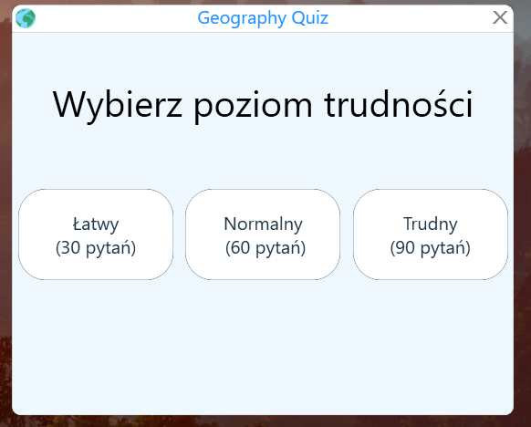
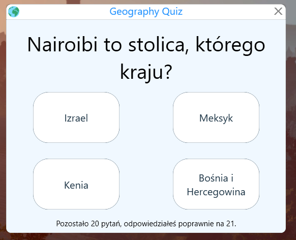
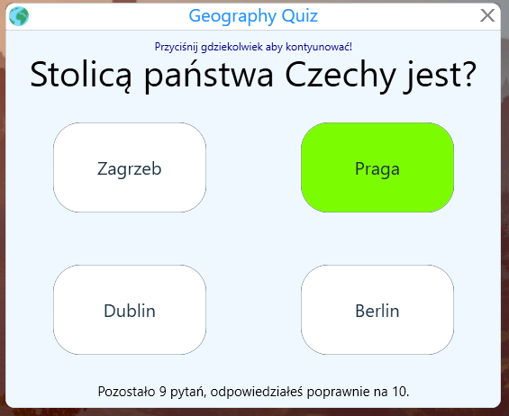

# GeographyQuiz
I've created this application to practise my knowledge about the capitals of the world. I've used WPF with MVVM pattern.
There are two game modes. In the first one you have to assign a capital to the country and in the second game mode, you have to assign a country to the capital.
There are also three difficulty levels. 
This game is in Polish, however code and code comments are in English.
# Screenshots 

